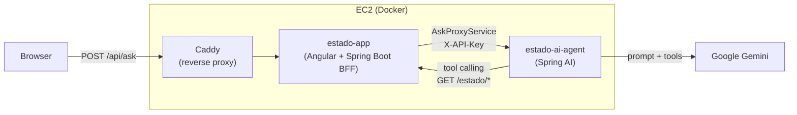

# Estado AI Agent

🇧🇷 [Ler em português](README.pt-BR.md)

An AI agent (LLM) that answers questions using the real, live data of the
[`estado`](https://github.com/ronybrand/estado) project's public API
(`https://54.94.231.248.sslip.io/estado/**`).

The system uses Google Gemini (Free Tier) via Spring AI 2.0+ with Tool
Calling, proving the model can consume up-to-date external data instead of
being limited to its training-time knowledge. The feature is exposed to end
users through the "Ask the AI" page in the
[`angular_estado`](https://github.com/ronybrand/angular_estado) frontend,
which calls this agent through a BFF proxy (`AskProxyService`) inside the
`estado` backend rather than talking to it directly.

## Architecture



The agent is never reachable from outside the EC2 instance directly — only
`estado-app` can call it (internal Docker network), and only the `estado-app`
BFF is exposed publicly via Caddy. This keeps `/ask` behind the same
authentication surface as the rest of the site instead of exposing a second
public entry point with its own quota.

## Features

- **`/ask` endpoint**: send a question about Brazilian states (e.g. *"What's
  Santa Catarina's abbreviation?"* or *"How many states are in the
  database?"*). The agent will:
  1. Identify the intent and parameters.
  2. Call a Java `Tool` that hits the real endpoint (`GET /estado/paginado`
     or `GET /estado/{id}`).
  3. Receive the HTTP JSON response, understand the data, and compose the
     final answer in natural language.
- **Authentication**: `/ask` requires the `X-API-Key` header, validated with
  a constant-time comparison against `ASK_API_KEY`.
- **Quota protection**: per-IP rate limiting (Bucket4j, in-memory), with
  capacity and window configurable via env vars — default of 10
  requests/minute, calibrated for the Gemini Free Tier.
- **Prompt injection defense**: two deterministic layers complement the
  system prompt's own instruction (which is probabilistic) — an input guard
  blocks the most common, known attempts before calling the LLM, and an
  output guard detects and replaces any response that reproduces the system
  prompt's internal rules.
- **Consistent error contract**: every error response (validation, upstream,
  authentication, rate limit, or any unmapped exception) follows the same
  JSON shape (`code`, `message`, `requestId`).
- **Request correlation**: every request gets an `X-Request-Id` (generated,
  or echoed back from the client if it's a valid UUID), present in the log,
  the response header, and the error body — and forwarded to the `estado`
  API, allowing logs to be correlated across both services.
- **Observability**: Spring Boot Actuator exposes `/actuator/health`,
  `/actuator/info` and `/actuator/metrics` (auto-instrumented via
  Micrometer, including `http.server.requests` per endpoint/status).
- **Quality and standards**: PMD (Best Practices + Error Prone), JaCoCo and
  CodeQL in CI, matching the standard adopted in the `estado` project.

## Requirements

- Java 25
- Maven (use the bundled `./mvnw`)
- A Google Gemini API key (free, at `ai.google.dev`)
- Access to a running `estado` API instance (local or remote)

## Configuration

None of the variables below have a default beyond what's indicated — the
application fails at boot without them:

| Variable | Required | Description |
|---|---|---|
| `GEMINI_API_KEY` | yes | Google Gemini API key |
| `ESTADO_API_BASE_URL` | yes | Base URL of the `estado` API (e.g. `http://localhost:8080`) |
| `ASK_API_KEY` | yes | Key required in the `X-API-Key` header to call `/ask` |
| `ASK_RATE_LIMIT_CAPACITY` | no (default `10`) | Requests per IP allowed per window on `/ask` |
| `ASK_RATE_LIMIT_WINDOW_MINUTES` | no (default `1`) | Rate limit window duration, in minutes |

## Running locally

1. Get a free Google Gemini API key at `ai.google.dev`.
2. Export the required environment variables (see table above):
   ```bash
   export GEMINI_API_KEY="your-gemini-key"
   export ESTADO_API_BASE_URL="http://localhost:8080"
   export ASK_API_KEY="any-key-for-local-testing"
   ```
3. Run the project: `./mvnw spring-boot:run`
4. Test the API:
   ```bash
   curl -X POST http://localhost:8080/ask \
        -H "Content-Type: application/json" \
        -H "X-API-Key: any-key-for-local-testing" \
        -d '{"question":"What is the abbreviation of the state of Paraná?"}'
   ```

## Tests

Tests don't consume quota and don't depend on the network or on
Gemini/`estado` API availability. We use explicit mocks of Spring AI's
`ChatClient` and of the `estado` API to keep CI fast and resilient,
including an end-to-end integration test (`@SpringBootTest`) that boots the
whole application with the real security filters.

Run: `./mvnw verify`

## Deploy

Zero-downtime rolling swap via a systemd timer, published to `ghcr.io` on
every merge to `main` (CI → Docker image build → automatic deploy). See
[`deploy/`](deploy/) and the ADRs in [`docs/adr/`](docs/adr/).

## ADRs

To understand this repository's architecture and design decisions, see
[`docs/adr/`](docs/adr/).
