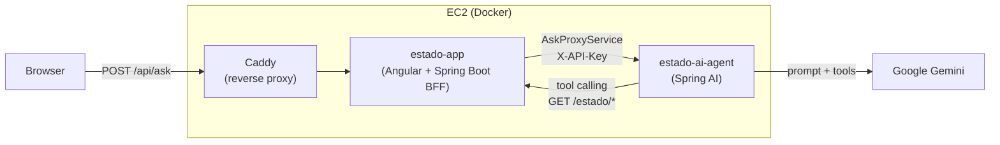

# Estado AI Agent

🇺🇸 [Read in English](README.md)

Um agente de inteligência artificial (LLM) focado em consultar os dados reais e vivos da API pública do projeto [`estado`](https://github.com/ronybrand/estado) (`https://54.94.231.248.sslip.io/estado/**`).

O sistema utiliza o Google Gemini (Free Tier) via Spring AI 2.0+ com a funcionalidade de *Tool Calling*, provando que a IA pode consumir dados externos atualizados em vez de se limitar ao conhecimento do seu treinamento base. A feature é exposta ao usuário final pela página "Pergunte à IA" no frontend [`angular_estado`](https://github.com/ronybrand/angular_estado), que chama este agente através de um proxy BFF (`AskProxyService`) dentro do backend `estado`, em vez de falar diretamente com ele.

## Arquitetura



O agente nunca é alcançável de fora da instância EC2 diretamente — só o `estado-app` consegue chamá-lo (rede interna do Docker), e só o BFF do `estado-app` é exposto publicamente via Caddy. Isso mantém o `/ask` atrás da mesma superfície de autenticação do resto do site, em vez de expor um segundo ponto de entrada público com quota própria.

## Funcionalidades

- **Endpoint `/ask`**: Envie uma pergunta sobre os estados brasileiros (ex: *"Qual a sigla de Santa Catarina?"* ou *"Quantos estados tem no banco?"*). O agente vai:
  1. Identificar a intenção e os parâmetros.
  2. Acionar uma `Tool` em Java para bater no endpoint real (`GET /estado/paginado` ou `GET /estado/{id}`).
  3. Receber o JSON da resposta HTTP, entender os dados, e compor a resposta final ao usuário em linguagem natural.
- **Modelo reserva**: se o modelo principal do Gemini estiver sobrecarregado (503), sem cota (429) ou lento
  (timeout), o agente tenta uma vez um modelo reserva (`app.gemini.fallback-model`). Outros erros não são
  repetidos. Ver [ADR 0009](docs/adr/0009-modelo-reserva-do-gemini-e-cadeia-de-timeouts.md).
- **Autenticação**: `/ask` exige o header `X-API-Key`, validado por comparação constant-time contra `ASK_API_KEY`.
- **Proteção de Quota**: Rate limiting por IP (Bucket4j, em memória), com capacidade e janela configuráveis via env vars - default de 10 requisições/minuto, calibrado para o Free Tier do Gemini.
- **Defesa contra prompt injection**: duas camadas deterministas complementam a instrução do próprio system prompt (que é probabilística) - uma guarda de entrada bloqueia as tentativas mais comuns e conhecidas antes de chamar o LLM, e uma guarda de saída detecta e substitui qualquer resposta que reproduza as regras internas do system prompt.
- **Contrato de erro consistente**: toda resposta de erro (validação, upstream, autenticação, rate limit ou qualquer exceção não mapeada) segue o mesmo formato JSON (`code`, `message`, `requestId`).
- **Correlação de requisições**: todo request recebe um `X-Request-Id` (gerado ou ecoado do cliente, se for um UUID válido), presente no log, no header de resposta e no corpo de erro - e repassado para a API de estados, permitindo correlacionar logs entre os dois serviços.
- **Observabilidade**: Spring Boot Actuator expõe `/actuator/health`, `/actuator/info` e `/actuator/metrics` (instrumentado automaticamente via Micrometer, incluindo `http.server.requests` por endpoint/status).
- **Qualidade e Padrões**: PMD (Best Practices + Error Prone), JaCoCo e CodeQL no CI, mantendo o padrão adotado no projeto `estado`.

## Requisitos

- Java 25
- Maven (usar o `./mvnw` incluso)
- Uma API key do Google Gemini (gratuita, em `ai.google.dev`)
- Acesso a uma instância da API `estado` rodando (local ou remota)

## Configuração

Nenhuma das variáveis abaixo tem valor padrão além das indicadas - a aplicação falha no boot sem elas:

| Variável | Obrigatória | Descrição |
|---|---|---|
| `GEMINI_API_KEY` | sim | API key do Google Gemini |
| `ESTADO_API_BASE_URL` | sim | URL base da API `estado` (ex.: `http://localhost:8080`) |
| `ASK_API_KEY` | sim | Chave exigida no header `X-API-Key` para chamar `/ask` |
| `ASK_RATE_LIMIT_CAPACITY` | não (default `10`) | Requisições por IP permitidas por janela em `/ask` |
| `ASK_RATE_LIMIT_WINDOW_MINUTES` | não (default `1`) | Duração da janela do rate limit, em minutos |
| `APP_GEMINI_FALLBACK_MODEL` | não (default `gemini-3.1-flash-lite`) | Modelo reserva tentado em 503/429/timeout; vazio desliga o fallback |
| `APP_GEMINI_TIMEOUT_MS` | não (default `15000`) | Timeout de cada chamada ao Gemini, em milissegundos |

## Como rodar localmente

1. Obtenha uma API key do Google Gemini (gratuita) em `ai.google.dev`.
2. Exporte as variáveis de ambiente obrigatórias (ver tabela acima):
   ```bash
   export GEMINI_API_KEY="sua-chave-do-gemini"
   export ESTADO_API_BASE_URL="http://localhost:8080"
   export ASK_API_KEY="uma-chave-qualquer-para-testes-locais"
   ```
3. Execute o projeto: `./mvnw spring-boot:run`
4. Teste a API:
   ```bash
   curl -X POST http://localhost:8080/ask \
        -H "Content-Type: application/json" \
        -H "X-API-Key: uma-chave-qualquer-para-testes-locais" \
        -d '{"question":"Qual a sigla do estado do Paraná?"}'
   ```

## Testes

Os testes não geram custo de quota e nem dependem da rede ou da disponibilidade do Gemini / API do Estado. Usamos mocks explícitos do `ChatClient` do Spring AI e da API de estados para garantir um CI rápido e resiliente, incluindo um teste de integração fim-a-fim (`@SpringBootTest`) que sobe a aplicação inteira com os filtros de segurança reais.

Execute: `./mvnw verify`

## Deploy

Rolling swap sem downtime via systemd timer, publicado em `ghcr.io` a cada merge em `main` (CI → build da imagem Docker → deploy automático). Ver `deploy/` e as ADRs em `docs/adr/`.

## ADRs

Para entender as decisões de arquitetura e design deste repositório, consulte a pasta `docs/adr/`.
